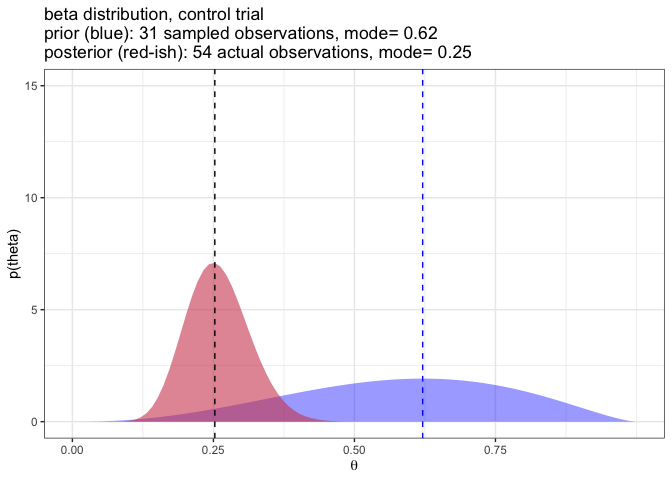
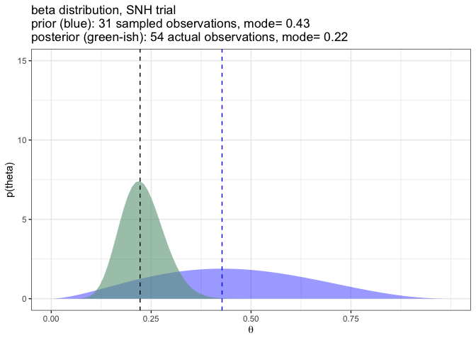
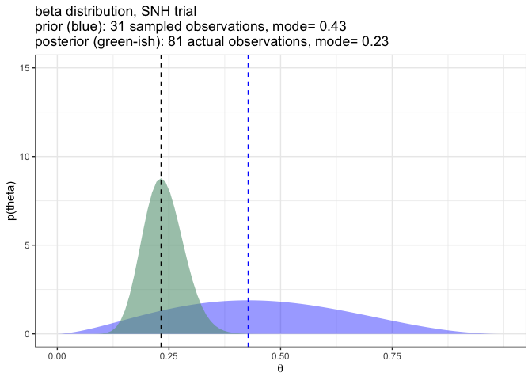
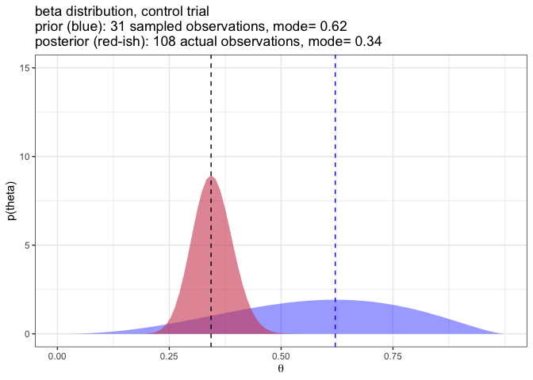
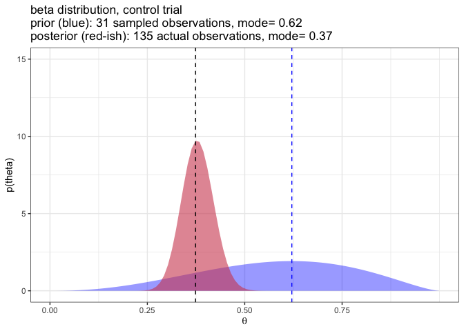
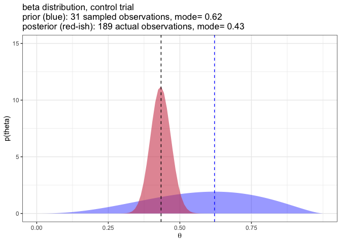
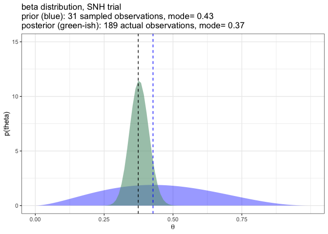
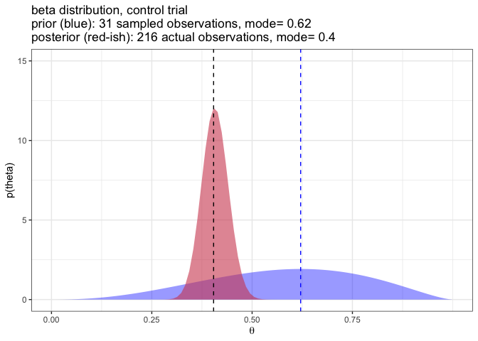
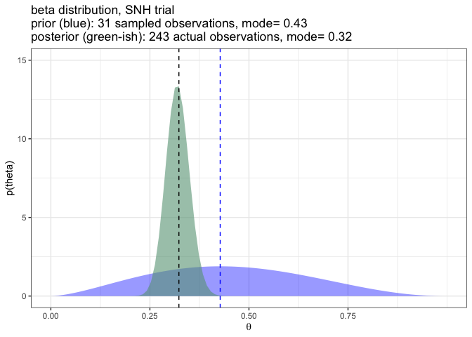

binomial crab spiders
================

**(a) the broader context:** I have two trials (‘control’ and ‘SNH’)
each of which has 270 spider count observations ( mostly 0’s, some small
counts (less than 5) ).

**(b) the research question:** are these two count populations
different?

  - can I use the characteristics of a calculated posterior distribution
    to compare the two populations?

  - how much bayesian ‘evidence’ is necessary for credibility of a
    bayesian posterior distribution? (This is similar to questions about
    sample size in classical analysis.)

  - is the following analytical approach valid?
    
      - convert these counts to a binomial sequence
      - define a 31 observation ‘prior’ for each trial (base::sample()
        the 270 observations)
      - create 90 evidence-buckets for each trial by chopping the actual
        trial data into sequentially increasing multiples of 3
        observations (evidence-bucket 1 has 3 observations,
        evidence-bucket 2 has 6 observations, ….)
      - calculate the Bernoulli distribution of each of the 90
        posteriors (for SNH and control) per
        <https://bookdown.org/content/3686/inferring-a-binomial-probability-via-exact-mathematical-analysis.html#specifying-a-beta-prior>
      - calculate and compare the modes for each of the 90 SNH:control
        posterior pairs. The mode (theta), or maximum likelihood
        estimate, is the true proportion of traps that are expected to
        capture a spider.

**(c) the issue I am having:** the variation of the posterior
distributions makes me think that, at minimum, to compare two
populations, the number of observations should at least match. (yuck\!
this is bad for comparing different timeframes or the work from another
investigator.) Does the mode provide any utility in terms of comparison
of the two populations?

<!-- -->

more binomial probability reading :
<https://willhipson.netlify.app/post/bayesian_intro/binomial_gold/>
